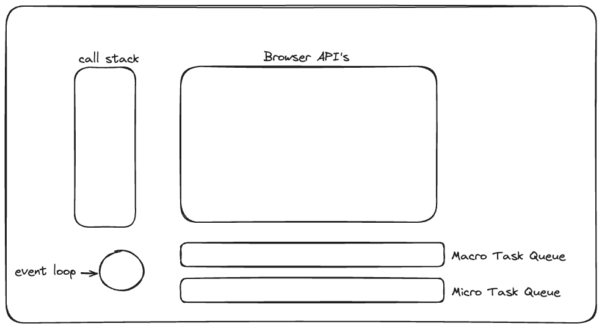

1. ### What is Event Loop and Async javascript

    Javascript is single threaded language but we do see asynchronous non-blocking behaviour in javascript. This behaviour is possible because of Event Loop.

    When an asynchronous task such as HTTP request or a DOM event is initiated, it is handed off to browser API's. Once these tasks are completed, their callbacks are placed into either microtask(priority) queue or the macrotask queue, depending upon the nature of the event.
    
    The event loop is a process that continuously monitors both the call stack and the event queue and checks whether or not the call stack is empty. If the call stack is empty and there are pending events in the event queue, the event loop dequeues the event from the event queue and pushes it to the call stack. The call stack executes the event, and any additional events generated during the execution are added to the end of the event queue.

    ```javascript
    const one   = () => console.log("First");
    const two   = () => setTimeout(()=>console.log("Second"),500);
    const three = () => console.log("Third");

    two();
    one();
    three();
    ```
    

    Output : 
            First
            Third
            Second

    Explanation : 
    1. two() get called first hence it is moved to call stack and then to Browser API's.
       then it get executed in Browser API's and then moved to macro task queue.

    2. while two is in macro task queue, one() gets called, being moved to call stack and prints "First".

    3. three() get called , being moved to call stack and prints "Third".         

    4. Event loop first checks micro tasks queue, which is empty then checks macro task queue and moves two to call stack for execution and prints "Second".


2. ### What is Hoisting

    In JavaScript, before executing any code, the JavaScript engine performs a memory preparation phase known as hoisting. During this phase, the engine allocates memory for variables and functions:

     1.Function declarations are fully hoisted, meaning they can be invoked anywhere within their scope, even before their actual line of declaration.

     2.Variables declared with var are hoisted and initialized with undefined. This means you can access var variables before their declaration, but their value will be undefined.

     3.Variables declared with let and const are also hoisted but remain uninitialized. Accessing them before their declaration in the code results in a ReferenceError.

    This period between the start of the block and the actual declaration of a let or const variable is called the Temporal Dead Zone (TDZ). The TDZ exists from the start of the block until the line where the variable is declared and initialized.

3. ### What is Scope and Scope Chaining?    
   
   Scope governs the accessibility of the declared variable. 

   There are 3 types of scopes:
   1. Gloabal Scope
   2. Local Scope
   3. Block Scope(Functional Scope)

   Block scope is the scope inside block ie {}.

   Global scope in case of browser it is window object and in case of execution environment like Nodejs it is Global (mostly black {}).

   Variables declared with var has global scope and variables decalred with let and const has block scope.
   

   **Scope Chaining** - 

   Javascript has its variable hunting mechanism.It hunts for variable until global scope or global execution context.

   for example - Js looks for variable declaration in block scope first, If it didn't find any declaration then it moves towards outer scope and with this same process it keeps on looking till the global execution context is reached.

   inner -> outer -> outer -> ...global


4. ### what is prototypal inheritance

   Prototypal inheritance refers to linking of prototypes of a parent object to a child object to share & utilize properties of parennt class.
   means sharing of properties, methods across objects can be done by prototypal inheritance
   
   single __proto__ can inherit only one class
   for multiple inheritance we use : __proto__.__proto__ // called as prototypal chaining as well.

   example - 1 (old way)
   ```javascript
   let company = {
     name: "Google",
     salary: function(){
        console.log("500k salary")
     }
   }

   let engineer = {
    empId = 123,
    task: function(){
        console.log("task assigned")
    }
   }

   engineer.__proto__ = company
   console.log(engineer)
   engineer.salary()
   ```
 example - 2 (latest way)
 ```javascript
    let company = {
     name: "Google",
     salary: function(){
        console.log("500k salary")
     }
   }

   let engineer = Object.create(company, {
    empId: { value: 123},
    task: {
            value: function() {
                console.log("task assigned");
            }
          }
});

console.log(engineer);
engineer.salary();
 ```

 Prototypal inheritance is a type of object-oriented programming inheritance in which an object inherits properties and methods from another object, known as its prototype. In this model, objects are created by cloning or copying an existing object, which serves as the prototype.

 In prototypal inheritance, each object in a program has a special internal property called [[Prototype]] (also sometimes called __proto__ in JavaScript). This property holds a reference to another object, known as its prototype.

 prototype is a property of a constructor function in JavaScript, while __proto__ is a property of every object.

 When you create a constructor function in JavaScript, it automatically gets a prototype property, which is an object. This object is used as the prototype for all objects created using the constructor function as a constructor with the new keyword. For example:

 Prototypal inheritance is used in many programming languages, including JavaScript, which uses prototypal inheritance as its primary mechanism for object-oriented programming.


 Object.getPrototypeOf() -
 Object.getPrototypeOf() returns the prototype of the specified object. This is useful for inspecting the prototype chain of an object.

 ```javascript
 const parent = {
    greet() {
        console.log(`Hello from ${this.name}`);
    }
 };

 const child = Object.create(parent);
 child.name = "Child";

 console.log(Object.getPrototypeOf(child) === parent); // true
 ```
 Object.getPrototypeOf(child) returns parent, confirming that child's prototype is parent.


 Object.setPrototypeOf() -
 Object.setPrototypeOf() sets the prototype (i.e., the internal [[Prototype]] property) of a specified object to another object or null.

 ```javascript
 const parent = {
    greet() {
        console.log(`Hello from ${this.name}`);
    }
 };

 const anotherParent = {
    greet() {
        console.log(`Hi from ${this.name}`);
    }
};

 const child = {
    name: "Child"
};

 // Initially set the prototype of child to parent
 Object.setPrototypeOf(child, parent);
 child.greet(); // Hello from Child
 
 // Change the prototype of child to anotherParent
 Object.setPrototypeOf(child, anotherParent);
 child.greet(); // Hi from Child
 ```
 in above code - 
 child's prototype is initially set to parent using Object.setPrototypeOf(child, parent).
 Later, child's prototype is changed to anotherParent using Object.setPrototypeOf(child, anotherParent).
 The greet method output changes accordingly, demonstrating the change in prototype.


5. ### What is property shadowing in prototypal inheritance

 Property shadowing in prototypal inheritance occurs when an object property has the same name as a property in its prototype chain. This means the object's property will shadow or override the property in the prototype chain, making the prototype property inaccessible through the object instance.

 ```javascript
 // Base object
const baseObject = {
    type: "Base",
    describe() {
        console.log(`This is a ${this.type} object.`);
    }
 };

 // Derived object inheriting from baseObject
 const derivedObject = Object.create(baseObject);
 derivedObject.type = "Derived";

 // Accessing properties and methods
 baseObject.describe();     // This is a Base object.
 derivedObject.describe();  // This is a Derived object.
 console.log(derivedObject.type); // Derived

 // Shadowing example
 console.log(baseObject.type); // Base
 console.log(derivedObject.type); // Derived
 ```
 baseObject is the base object with a type property and a describe method.
 derivedObject is created using Object.create(baseObject), so it inherits from baseObject.
 derivedObject defines its own type property, which shadows the type property in baseObject.
 When we call describe() on derivedObject, it uses the type property from derivedObject itself, not from baseObject, demonstrating property shadowing.

6. ### What is Monkey Patching 

 Monkey patching is a technique to add, modify, or suppress the default behavior of a piece of code at runtime without changing its original source code.

 Monkey patching is often considered a dangerous technique. Not too long ago, the use of Monkey patching has caused the rename of ECMAScript’s 2015 method String.prototype.contains() to String.prototype.includes().

 This change was necessary to avoid that websites using MooTools, which adds a contains() method to String.prototype, were broken due to introduction of the ECMAScript version of the method. In particular, the problem was that the contains() method added by MooTools and the contains() method added in ECMAScript 2015 were incompatible.

 The lesson to learn here is that Monkey patching, especially when used on a built-in object, can interfere with the evolution of the language.

 for example avoid modifying array methods like Array.prototype.newlength because later versions of JS might introduce methods with same name and your code might break.


7. ### What is Promises

 Promise object represents the eventual completion (or failure) of an asynchronous operation and its resulting value.

 Promise is a placeholder for a certain period of time until we receive a value from an asynchronous operation. OR

 In JavaScript, a Promise is an object that represents a value that may not be available yet, but will be resolved at some point in the future. Promises are commonly used for asynchronous programming, where a task may take some time to complete and you don't want to block the rest of the code from executing.

  states of promises;
  pending: initial state before promise is succeed or fail
  resolved: promise completed
  rejected: failed promise'

 To use a Promise, you can attach then and catch methods to it, which will be called when the Promise is resolved or rejected, respectively. For example:

  ```` javascript 
  const mypromise-new promise((resove, reject)=>{
  let condition=true
  if(condition){
  resolve("promise resolve")
  }
  else{
  reject("promise reject")
  }
  })

  //using promises:
  mypromise. Then((res)=>{
  console. Log(res)
  }). Catch((err)=>console. Log(err))
  ````

  
  
  
  ````javascript
  console.log("start");

setTimeout(() => {
  console.log("setTimeout");
}, 0);

Promise.resolve("Promise!").then((res) => console.log(res));

console.log("End!");

/* 
o/p -
start
End! 
Promise! 
setTimeout
*/

/**
 * first console was executed and start is printed
 * then it goes to setTimeout, setTimeout is added in task queue/ macro task queue and waiting for call stack to clear
 * then promise is executed and it is added in micro task queue where it is waiting to be resolved
 * then the last console.log executed which is End! in this case.
 * Now call stack is empty. Event loop now will check for the task in micro and task queue.
 * As micro stack has higher priority, Promise will be executed first and after that setTime out in task/Macro task queue is executed.
 */

  ````
